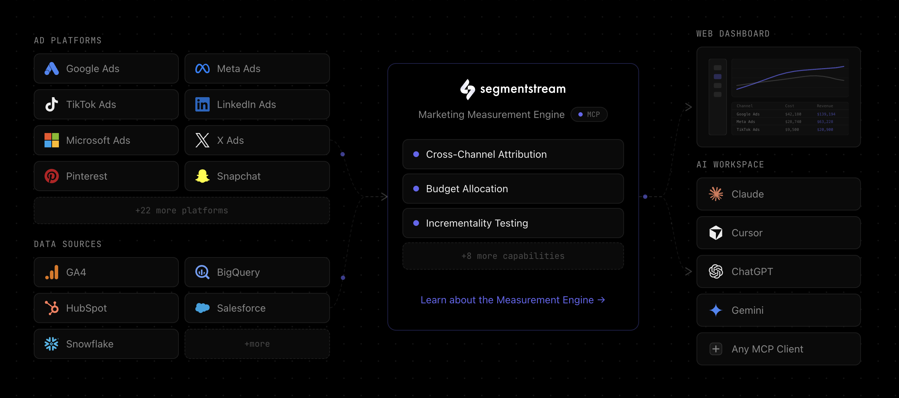

# SegmentStream Agent Skills

<p align="center">
  
</p>

Marketing measurement agent powered by [SegmentStream](https://segmentstream.com). Analyzes campaign performance, diagnoses attribution issues, and provides actionable measurement advice — all through natural conversation. Works with Claude Code, Cursor, Claude.ai, Cowork, and any MCP-compatible client.

## Features

- **Campaign performance reports** — Query cost, revenue, ROAS, CPA, and more by campaign, channel, source, or date. Data is presented with clear interpretation, not just raw numbers.
- **Attribution analysis** — Compare last-click vs. ML-powered attribution to understand which channels truly drive conversions.
- **Budget optimization** — Review portfolio performance, marginal ROAS, and diminishing return curves. Get data-driven budget reallocation recommendations.
- **Incrementality experiments** — Analyze geo holdout test results and interpret incrementality findings.
- **Audience insights** — Explore audience segments, membership statistics, and per-user audience queries.
- **User journey debugging** — Trace individual user paths through sessions, touchpoints, and conversion events.
- **BigQuery analysis** — Run custom SQL against your SegmentStream dataset for deep exploration beyond standard reports.
- **Measurement strategy advice** — Get expert guidance on attribution approaches, incrementality testing, and common measurement pitfalls.
- **Data source health monitoring** — Check ad platform data flow, cost quality scores, import logs, and active incidents.
- **Branded report generation** — Export analyses as polished HTML reports with the SegmentStream dark theme, or as JSX artifacts in Cowork.
- **Project memory** — The agent remembers your preferred metrics, default conversion/attribution model, and past analyses across conversations.

## Installation

### Option 1: Claude Marketplace

```bash
claude plugin install segmentstream
```

### Option 2: npx

```bash
npx @segmentstream/agent-skills
```

### Option 3: Git clone

```bash
git clone https://github.com/segmentstream/agent-skills
claude --plugin-dir ./agent-skills
```

## Authentication

The plugin uses **OAuth** to authenticate with SegmentStream. On first use, you'll be prompted to sign in through your browser — no API keys or environment variables needed.

1. Start Claude Code with the plugin enabled.
2. When you first use a SegmentStream tool, an OAuth flow will open in your browser.
3. Sign in with your SegmentStream account and authorize the connection.
4. The session token is cached locally — you won't need to re-authenticate until it expires.

Verify the connection by running `/mcp` in Claude Code — the SegmentStream server should appear as connected.

## Quick Start

1. Install the plugin using one of the methods above.
2. Start a conversation and run `/segmentstream:setup` to discover and configure your project.
3. Ask questions about your marketing data:
   - "How are my Google Ads campaigns performing this month?"
   - "Which channels have the best ROAS?"
   - "Show me conversion trends for the last 30 days"
   - "Is my Facebook cost data complete?"

## Commands

| Command | Description |
|---------|-------------|
| `/segmentstream:setup` | Discover your SegmentStream projects and configure the local project connection. Creates `.claude/segmentstream.local.md` with project context. |
| `/segmentstream:refresh` | Re-sync project configuration — useful after adding new data sources, conversions, or attribution models in SegmentStream. |

## Skills

| Skill | Description |
|-------|-------------|
| **Reports** | Detailed querying patterns, available dimensions and metrics, report configuration. |
| **Measurement** | Attribution methodology, incrementality testing, media mix modeling concepts. |
| **Setup** | Project discovery, configuration, and local settings management. |

## Configuration

The agent stores project context in `.claude/segmentstream.local.md` (gitignored by default). This file is created automatically during setup and contains:

- Project ID and name
- Configured attribution models
- Conversion types
- Connected data sources

This allows the agent to skip project discovery on subsequent conversations and provide contextual responses immediately.

To reconfigure, delete the file and run `/segmentstream:setup` again, or use `/segmentstream:refresh` to update it in place.

### `settings.json`

The `settings.json` file at the plugin root tells Claude Code which agent to activate as the default when the plugin is enabled. The value `"agent": "segmentstream"` means the SegmentStream agent becomes the primary agent for the session, handling all marketing measurement and analytics queries automatically.

## Platform Support

This plugin works across the Claude ecosystem and beyond:

- **Claude Code** — Full plugin support with skills, commands, and agent definition
- **Claude.ai / Cowork** — MCP tools available via the SegmentStream connector; JSX artifact reports
- **Cursor** — Ships with `.cursor-plugin/` manifest alongside `.claude-plugin/`
- **Any MCP client** — The SegmentStream MCP server works with any client that supports the Model Context Protocol

## Staying Up to Date

Skills are under active development — new dimensions, metrics, and measurement content are added regularly.

- **Marketplace**: `claude plugin update segmentstream`
- **npx**: Always pulls the latest version automatically
- **Git clone**: `git pull origin main`

## Reporting Issues

Found a bug, incorrect metric, or misleading measurement advice? [Open an issue](https://github.com/segmentstream/agent-skills/issues) with:

- What you asked the agent
- What it did (or didn't do)
- What you expected instead
- Your install method (marketplace / npx / git)

## Development

### Local development setup

To work on the plugin while keeping your installed version intact:

```bash
claude --plugin-dir /path/to/agent-skills
```

The `--plugin-dir` flag loads your local source copy for the current session. If you also have the plugin installed via the marketplace, the local copy takes precedence — all other installed plugins continue to work normally.

### Edit-test loop

1. Open the plugin source in your editor.
2. Run `claude --plugin-dir ./agent-skills` in a terminal.
3. Edit skills, commands, or agents.
4. Run `/reload-plugins` inside the Claude Code session to pick up changes without restarting.

MCP server configuration changes (`.mcp.json`) require a full restart.

## Contributing

### Getting started

1. Fork the repository
2. Create a feature branch
3. Make your changes and test locally:
   ```bash
   claude --plugin-dir ./agent-skills
   ```
4. Open a pull request

### Updating skills

Skills follow [Anthropic's plugin-dev conventions](https://github.com/anthropics/claude-code-plugins):

- **SKILL.md** — Keep lean (1,500–2,000 words). Use imperative form ("Query the report" not "You should query"). Description must be third-person ("This skill should be used when...").
- **references/** — Detailed content goes here, not in SKILL.md. Load on demand, not always.
- **Measurement content** — Tier 1 (philosophy) and Tier 2 (methodology) only. No implementation specifics, algorithms, or internal model details.

### Adding dimensions or metrics

Edit `skills/reports/references/dimensions-metrics.md`. Follow the existing table format with columns for name, description, example values, and common use cases.

### Testing changes

Verify skills trigger correctly by asking questions that match the trigger phrases in each skill's `description` field. Use `claude --plugin-dir ./agent-skills` to test with a local copy.

## License

[MIT](LICENSE) -- Copyright 2026 SegmentStream
